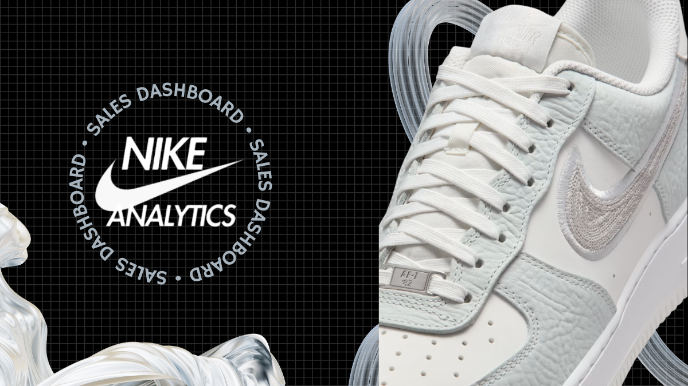

<h2 align="center">Database Administrator | Performance & Reliability Focused</h2>

  Designing secure, scalable and high-performance database infrastructures

  

---

## 🧠 About Me

I specialize in building reliable relational database environments focused on performance, availability, and security.

I don’t just build dashboards —  
I design complete database systems, optimize queries under load, simulate failures, and implement measurable improvements in speed and reliability.

---

## ⚙️ Core Technologies

  
  
  
  

---

# 🚀 Featured Projects

---

## 🔥 Nike Sales Dashboard

  

Large-scale structured sales dataset analysis with optimized queries, filtered dashboards, and performance-tested reporting.

## 📊 GitHub Stats

---

## 🎯 Engineering Philosophy

• Prevent failures before they happen  
• Measure performance, don’t assume  
• Automate repetitive processes  
• Design for scalability  
• Optimize for reliability  

Databases are not storage —  
They are the backbone of scalable systems.

---
